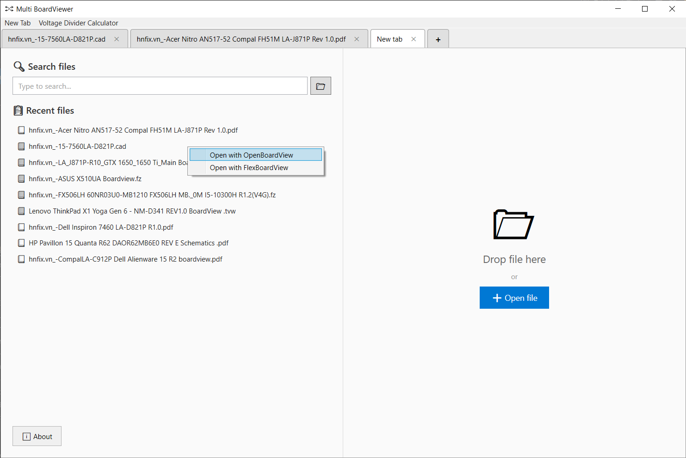

# Multi BoardViewer

Ứng dụng Windows giúp xem nhiều **Sơ đồ mạch** và **Sơ đồ nguyên lý** trong cùng một ứng dụng

  




## 🙏 Lời cảm ơn

Xin chân thành cảm ơn:
- **[BoardViewer.net](https://www.boardviewer.net/)** - phần mềm xem boardview thông dụng
- **[sumatrapdfreader](https://github.com/sumatrapdfreader)** - trình đọc PDF mã nguồn mở 
- **[OpenBoardView](https://github.com/OpenBoardView)** - phần mềm xem board view mã nguồn mở
- **[FlexBoardView](https://pldaniels.com/flexbv5/)** - phần mềm xem board view đa năng

Dự án này sử dụng sản phẩm của họ để tạo nên trải nghiệm xem file đa năng trong một ứng dụng duy nhất

## ✨ Tính năng

- 🔧 **BoardViewer Integration**: Xem các file schematic/board (.brd, .bdv, .fz, .cad, v.v.)
- 📄 **PDF Viewer**: Xem file PDF với SumatraPDF tích hợp
- 📑 **Multi-tab**: Mở nhiều file cùng lúc trong các tab riêng biệt
- 🔎 **Search files**: Tìm kiếm file trong thư mục/ổ đĩa được chỉ định

## 📋 Yêu cầu hệ thống

- Windows 10/11
- [.NET 8.0 Runtime](https://dotnet.microsoft.com/download/dotnet/8.0)

## 🚀 Cài đặt và chạy

### Cách 1: Tải bản Release

1. Tải file từ [Releases](https://github.com/mhqb365/Multi-BoardViewer/releases)
2. Giải nén và chạy `MultiBoardViewer.exe`

### Cách 2: Build từ source

```powershell
# Clone repository
git clone https://github.com/mhqb365/Multi-BoardViewer.git
cd Multi-BoardViewer

# Build
.\Build.bat

# Chạy
.\Run.bat
```

## 📖 Hướng dẫn sử dụng

### Mở file

- **Drag & Drop**: Kéo thả file vào cửa sổ ứng dụng
- **Tab mới**: Click nút **+** để tạo tab mới, sau đó kéo thả file vào
- **Recent files**: Mở tab mới và chọn file từ danh sách gần đây
- **Search files**: Chọn thư mục/ổ đĩa chứa file ở icon thư mục → Nhập tên file vào ô tìm kiếm → Click file để mở
- **Mặt định**: File boardview sẽ mở bằng BoardViewer, click chuột phải để mở bằng OpenBoardView hoặc FlexBoardView
- **Open with**: Chuột phải file → Open with → MultiBoardViewer

### Quản lý tab

- Click **+** để tạo tab mới
- Click **✕** trên tab để đóng tab
- Click vào tab để chuyển đổi giữa các file

### Định dạng file hỗ trợ

| Viewer | Định dạng |
|--------|-----------|
| BoardViewer | `.brd`, `.bdv`, `.fz`, `.cad`, `.asc`, v.v. |
| OpenBoardView | `.brd`, `.bdv`, `.fz`, `.cad`, `.asc`, v.v. |
| FlexBoardView | `.brd`, `.bdv`, `.fz`, `.cad`, `.asc`, v.v. |
| SumatraPDF | `.pdf` |

## ❓ Xử lý sự cố

| Vấn đề | Giải pháp |
|--------|-----------|
| Phím tắt không hoạt động | Click vào vùng BoardViewer trong tab để set focus |
| BoardViewer thoát khi tạo tab mới | Options > Options > bỏ tick Use Only Instance of Program |
| Tab mới không hiển thị gì | Đợi vài giây hoặc thử đóng tab và mở lại |

## 💡 Tips

- Hover vào tab để tự động set focus
- Mỗi tab hoàn toàn độc lập với nhau
- File đã mở sẽ không được mở trong tab mới mà chuyển sang tab hiện có

---

## 🛠️ Development

### Công nghệ

- **Framework**: WPF + C# .NET 8.0
- **Windows API**: SetParent, MoveWindow (Process embedding)
- **External Tools**: BoardViewer, SumatraPDF (plugin mode)

### Cấu trúc dự án

```
Multi-BoardViewer/
├── MultiBoardViewer/          # Source code chính
│   ├── MainWindow.xaml        # Giao diện UI
│   ├── MainWindow.xaml.cs     # Logic xử lý tab và embedding
│   ├── App.xaml.cs            # Single instance handling
│   └── ...
├── BoardViewer/               # BoardViewer executable
├── SumatraPDF/                # SumatraPDF executable
├── Build.bat                  # Script build
└── Run.bat                    # Script chạy ứng dụng
```

## 📄 License

MIT License

## ☕ Buy me a coffee

Nếu bạn sử dụng và thấy hữu ích, hãy ủng hộ mình một ly cà phê nhé! 😊

| Binance | Vietcombank |
|:-------:|:-------:|
|  |  |

Hứa sẽ ⭐ 🐔 đầy đủ! 🤩