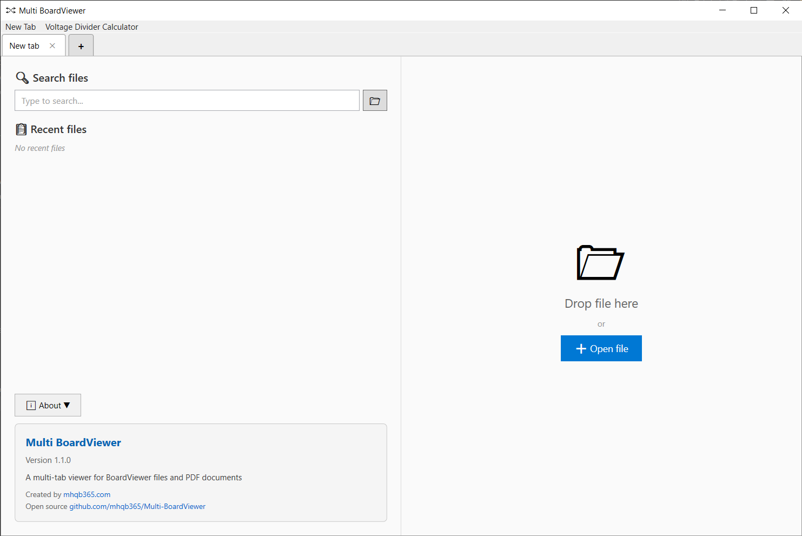
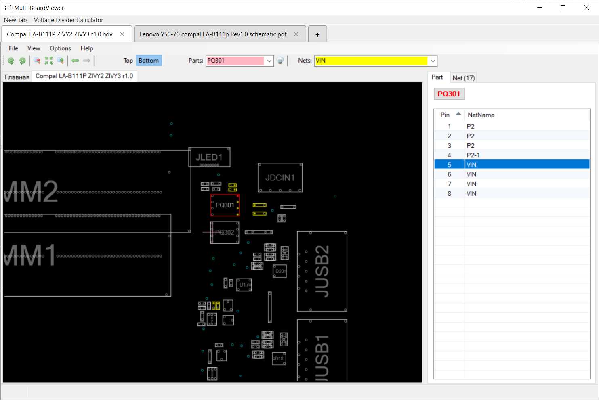
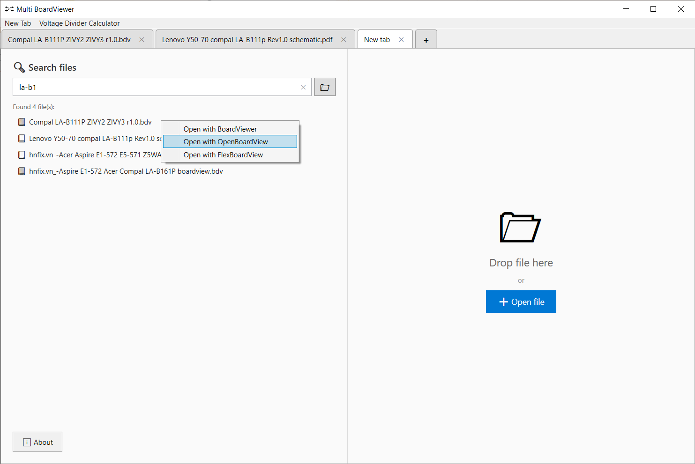

# Multi BoardViewer

Ứng dụng Windows giúp xem nhiều sơ đồ mạch (board view) và sơ đồ nguyên lý (schematic) trong cùng một ứng dụng

  





## 🙏 Lời cảm ơn

Xin chân thành cảm ơn:
- **[BoardViewer.net](https://www.boardviewer.net/)** - phần mềm xem boardview thông dụng
- **[OpenBoardView](https://github.com/OpenBoardView)** - phần mềm xem board view mã nguồn mở
- **[FlexBoardView](https://pldaniels.com/flexbv5/)** - thêm một phần mềm xem board view nữa
- **[SumatraPDF](https://github.com/sumatrapdfreader)** - trình đọc PDF mã nguồn mở
- **[ChinaFix - Voltage Divider Calculator](https://www.xinxunwei.com/)** - phần mềm tính toán điện áp qua cầu phân áp

Dự án này sử dụng sản phẩm của họ để tạo nên trải nghiệm xem file đa năng trong một ứng dụng duy nhất

## ✨ Tính năng

- **Multi-tab**: Mở nhiều file cùng lúc trong các tab riêng biệt
- **Multi BoardViewer**: Xem các file board view với nhiều lựa chọn viewer khác nhau
- **PDF Viewer**: Xem file PDF với SumatraPDF tích hợp
- **Search files**: Tìm kiếm file trong thư mục hoặc ổ đĩa được chỉ định
- **Voltage Divider Calculator**: Tính toán điện áp qua cầu phân áp

## 📋 Yêu cầu hệ thống

- Windows 10/11
- [.NET 8.0 Runtime](https://dotnet.microsoft.com/download/dotnet/8.0)

## 🚀 Cài đặt và chạy

### Cách 1: Tải bản Release

1. Tải file từ [Releases](https://github.com/mhqb365/Multi-BoardViewer/releases)
2. Giải nén và chạy `MultiBoardViewer.exe`

### Cách 2: Build từ source

```powershell
# Clone repository
git clone https://github.com/mhqb365/Multi-BoardViewer.git
cd Multi-BoardViewer

# Build
.\Build.bat

# Chạy
.\Run.bat
```

## 📖 Hướng dẫn sử dụng

### Mở file

- **Tab mới**: Click nút **+** để tạo tab mới → Kéo thả file vào phần cửa sổ bên phải của ứng dụng hoặc click nút **+ Open file** và dẫn đến file cần mở
- **Search files**: Chọn thư mục hoặc ổ đĩa chứa các file tài liệu ở icon thư mục → Nhập tên file vào ô tìm kiếm → Click file để mở bằng BoardViewer hoặc click chuột phải vào file để chọn viewer
- **Recent files**: Mở tab mới và chọn file từ danh sách gần đây

### Định dạng file hỗ trợ

| Viewer | Định dạng |
|--------|-----------|
| BoardViewer | `.brd`, `.bdv`, `.fz`, `.cad`, `.tvw`, `.asc`, v.v. |
| OpenBoardView | `.brd`, `.bdv`, `.fz`, `.cad`, v.v. |
| FlexBoardView | `.brd`, `.bdv`, `.fz`, `.cad`, v.v. |
| SumatraPDF | `.pdf` |

---

## 🛠️ Development

### Công nghệ

- **Framework**: WPF + C# .NET 8.0
- **Windows API**: SetParent, MoveWindow (Process embedding)
- **External Tools**: BoardViewer, OpenBoardView, FlexBoardView, SumatraPDF, VoltageDividerCalculator

### Cấu trúc dự án

```
Multi-BoardViewer/
├── MultiBoardViewer/          # Source code chính (WPF .NET 8)
│   ├── MainWindow.xaml        # Giao diện chính và quản lý tab
│   ├── App.xaml               # Cấu hình ứng dụng
│   └── ...
├── BoardViewer/               # Tool BoardViewer (mặc định)
├── OpenBoardView/             # Tool OpenBoardView (mã nguồn mở) 
├── FlexBoardView/             # Tool FlexBoardView
├── SumatraPDF/                # Trình xem PDF (SumatraPDF)
├── VoltageDividerCalculator/  # Công cụ tính toán điện áp
├── Photos/                    # Hình ảnh minh họa cho README
├── MultiBoardViewer.sln       # Solution file
├── Build.bat                  # Script build tự động
└── Run.bat                    # Script chạy ứng dụng nhanh
```

## 📄 License

MIT License
